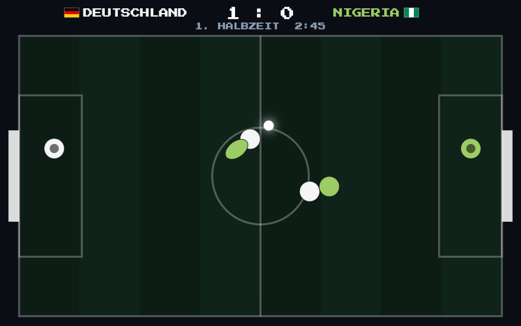
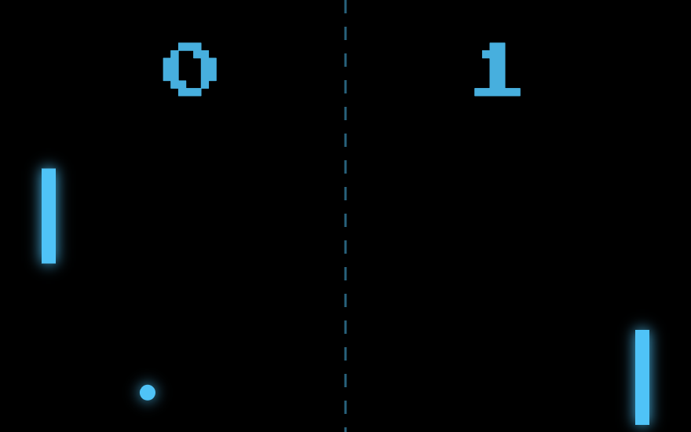
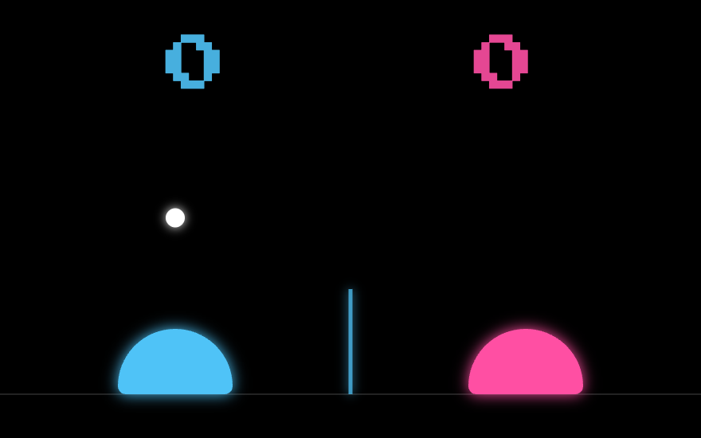
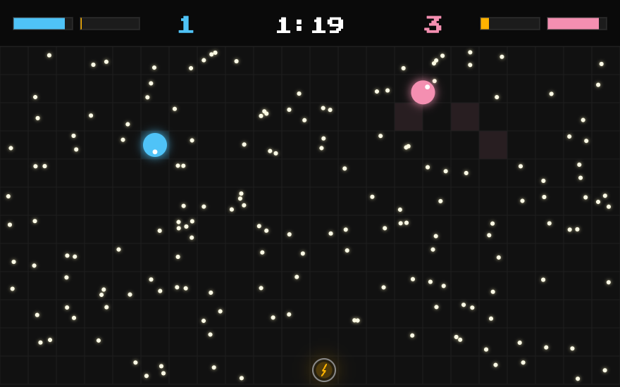
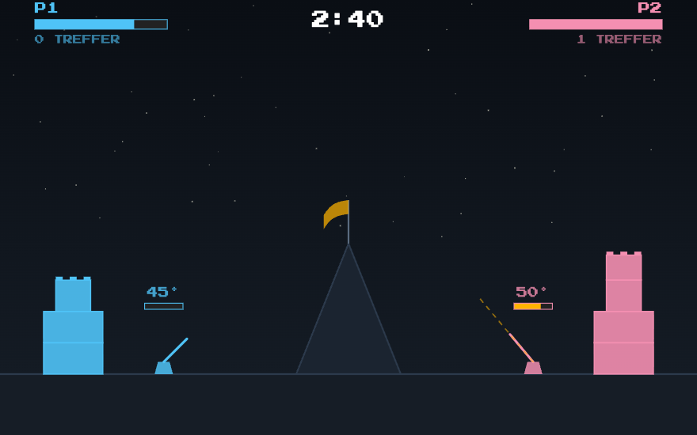
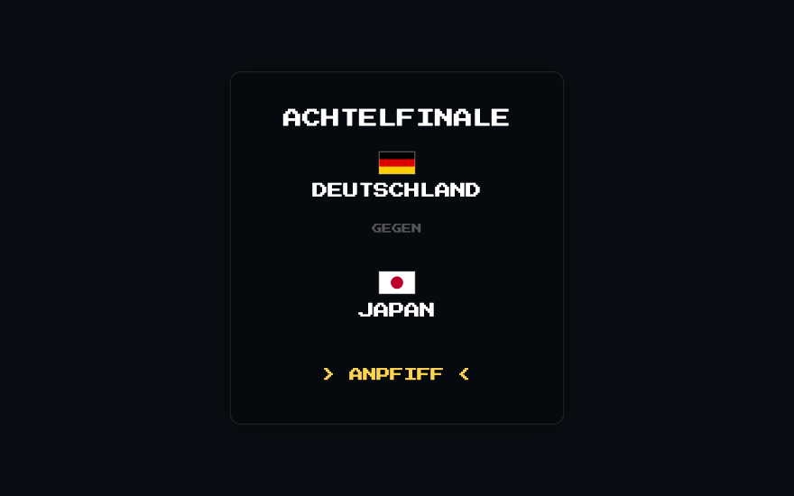
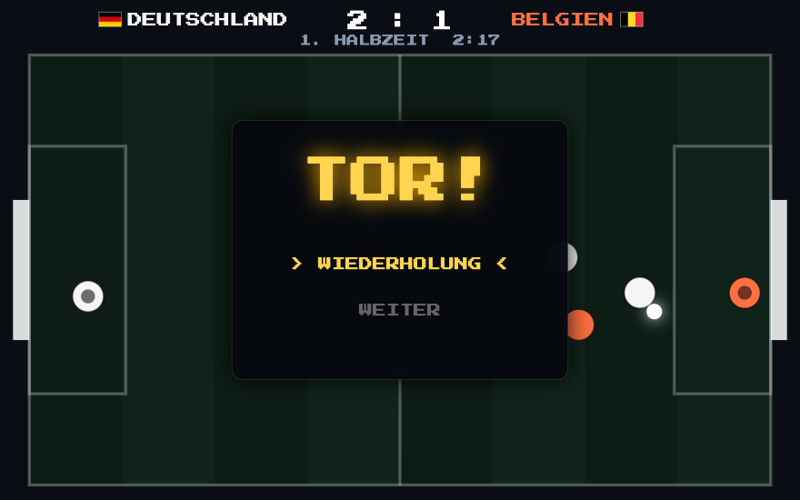

# RETROCON

**Eine Retro-Spielkonsole im Browser. Der Bildschirm ist das Spielfeld, das Smartphone der Controller.**

Kein App-Download, kein Login, kein Server: QR-Code scannen, losspielen. Die Verbindung läuft direkt zwischen Telefon und Bildschirm über WebRTC.

**▶ Spielen: https://mirkoappel.github.io/retrocon/**



---

## Wie es funktioniert

Alle sitzen vor einem Bildschirm — Laptop, Fernseher, Beamer. Der zeigt die Konsole. Jede Sitzung bekommt einen **vierstelligen Raum-Code**, damit mehrere Gruppen nebeneinander spielen können, ohne sich zu stören.

Wer mitspielen will, scannt den QR-Code mit dem Telefon. Die Seite, die sich dann öffnet, **ist** der Controller: Joystick, zwei Tasten, Vibration. Sie lässt sich als PWA installieren, muss es aber nicht.

Dazwischen liegt kein Spieleserver. Die Steuerbefehle gehen per WebRTC direkt vom Telefon an den Bildschirm; ein öffentlicher PeerJS-Broker vermittelt nur den ersten Handschlag.

**Es geht auch ohne Telefon.** Spieler 1 hat immer die Pfeiltasten, Spieler 2 steigt mit WASD ein, sobald er drückt. Und wer gar nichts tut, bekommt eine KI, die für ihn weiterspielt — auch mitten im Match.

---

## Die Spiele

| | |
|---|---|
|  | **PONG** · 1–2 Spieler<br>Der Klassiker. Joystick bewegt das Paddel, erster auf 10 Punkte gewinnt. |
|  | **VOLLEYBALL** · 1–2 Spieler<br>Slime-Volleyball. Joystick bewegt, A springt, erster auf 7 Punkte gewinnt. |
|  | **DUST RUSH** · 1–2 Spieler<br>Saugroboter-Rennen mit Panzersteuerung. Staub sammeln, rechtzeitig zur Ladestation, meiste Punkte in 90 Sekunden. |
|  | **CATAPULT** · 1–2 Spieler<br>Burgen-Duell über einen Berg hinweg. Der Winkel wird gestellt, die Taste lädt die Kraft, die Fahne zeigt den Wind. Gewonnen hat, wer alle gegnerischen Steine abräumt. |
|  | **STREET SOCCER** · 1–2 Spieler<br>Kleinfeld-Fußball von oben, drei gegen drei. Miteinander oder gegeneinander, 16 Mannschaften, Weltmeisterschaft über vier Runden. |

### Zum Beispiel STREET SOCCER

Das jüngste und aufwendigste Spiel. Ein paar Dinge, die darin stecken:



- **Der Ball klebt nicht.** Er wird angetippt und rollt frei weiter; die Vorlage wird länger, je schneller man läuft, und folgt der Laufrichtung, damit man Kurven laufen kann.
- **Getreten wird nur bei Berührung.** Schuss, Pass und Dribbelstoß lösen erst aus, wenn der Spielerrand den Ballrand wirklich berührt.
- **Zwei Stufen auf einer Taste.** Kurz antippen greift an, gehalten wird daraus eine Grätsche mit Antritt, Rutschen und Liegezeit.
- **Hechtsprung vor dem Tor**, und der Torwart hechtet auch — er fängt den Ball, statt ihn abzufälschen.
- **Wiederholung in Zeitlupe** nach jedem Tor, Höhepunkte aller Tore nach dem Spiel.
- **Zusehen ist kein Modus.** Wer nach der Mannschaftswahl nichts mehr drückt, sieht der KI zu: Jede Tafel läuft von selbst weiter, und nach dem Abpfiff beginnt das nächste Spiel.

---

## Selbst laufen lassen

Es gibt keinen Build-Schritt. Ein beliebiger statischer Server genügt:

```bash
python3 -m http.server 8000
```

Dann `http://localhost:8000/console/` öffnen. Für die QR-Codes muss die Seite über HTTPS oder `localhost` erreichbar sein — Kamera und WebRTC verlangen das.

---

## Prüfstand

```bash
node tests/run.js          # die schnellen Fälle, unter einer Sekunde
node tests/run.js --full   # zusätzlich die statistischen, mehrere Minuten
node tests/run.js soccer   # nur ein Teil
```

Kein Build, keine Abhängigkeiten: Die Spieldateien werden eingelesen und in einer Node-Umgebung ausgeführt, in der `window` und ein Canvas-Kontext nachgebildet sind. Beobachtet wird möglichst so, wie es ein Mensch sähe — über die Texte, die das Spiel zeichnet.

**Jeder der 19 Fälle steht für einen Fehler, der schon einmal im Spiel war**, nicht für eine ausgedachte Möglichkeit: Spieler mit unsichtbaren Füßen, Bälle, die bei jeder Kurve verlorengingen, ein Anstoß, der ins Leere lief, eine Ballabnahme von hinten, die geometrisch unmöglich war. Details in [tests/README.md](tests/README.md).

---

## Aufbau

```
console/                 Die Konsole — Boot, Menü, Einstellungen, Spielfläche
  services/              Verbindung (PeerJS), Ton, Einstellungen
  views/                 Boot, Controller-Setup, Menü, Spielansicht
controller/              Der Smartphone-Controller, als PWA installierbar
  variants/classic/      Joystick + zwei Tasten
games/                   Ein Ordner je Spiel
  soccer/                soccer.js · soccer.render.js · soccer.data.js
tests/                   Prüfstand: run.js, harness.js, cases/
docs/                    Ausführliche Dokumentation und Bilder
```

Ein Spiel meldet sich an `window.RetroGames` an und bekommt beim Start ein `api`-Objekt (Beenden, verbundene Controller, Ton, eigene Einstellungen). Mehr dazu in [docs/games.md](docs/games.md) — dort steht auch, wie man ein eigenes Spiel hinzufügt.

---

## Technik

| | |
|---|---|
| **Kein Build** | Alles läuft im Browser, wie es im Repo liegt. Kein npm, kein Bundler |
| **WebRTC** | Steuerbefehle gehen direkt vom Telefon an den Bildschirm |
| **Canvas 2D** | Jedes Spiel zeichnet selbst, 60 Bilder pro Sekunde |
| **Web Audio** | Alle Klänge werden aus Oszillatoren erzeugt, keine Audiodateien |
| **PWA** | Der Controller lässt sich auf dem Telefon installieren |
| **GitHub Pages** | Push auf `main` genügt |

Eine Eigenheit, die wichtig ist: GitHub Pages liefert `cache-control: max-age=600`. Die Spieldateien tragen deshalb die Version im Namen (`soccer.js?v=0.21.0`) — sonst mischt der Browser bis zu zehn Minuten lang eine alte Spieldatei zu einer neuen Seite, und ein längst behobener Fehler sieht aus, als wäre er zurück.

---

## Dokumentation

| Datei | Inhalt |
|---|---|
| [console/README.md](console/README.md) | Menüaufbau, Einstellungen, wer welchen Platz steuert |
| [controller/README.md](controller/README.md) | Controller-Varianten, Gamepad-Protokoll, PWA |
| [games/soccer/README.md](games/soccer/README.md) | STREET SOCCER im Detail — Ballführung, Zweikampf, KI, Balance |
| [docs/games.md](docs/games.md) | Wie man ein Spiel hinzufügt |
| [docs/architecture.md](docs/architecture.md) | Wie die Teile zusammenhängen |
| [tests/README.md](tests/README.md) | Prüfstand |
| [CHANGELOG.md](CHANGELOG.md) | Was sich wann geändert hat, und warum |

---

## Was noch fehlt

- Fußball-Standards: Einwurf, Ecke, Abstoß statt Abpraller an der Seitenlinie; Fouls für die Grätsche
- Klügere KI im Passspiel — Manndeckung statt Ballklumpen, damit Ballbesitz länger als 1,2 Sekunden hält
- Mehr als zwei Spieler an einem Bildschirm
- Bestenlisten, die einen Neustart überleben
- Weitere Spiele: Tron, Breakout, Snake
